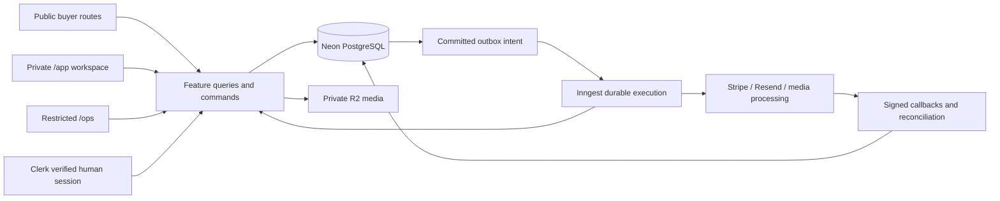

# Architecture — one modular Next.js application

## Foundation reuse boundary

The October 1 selection retains this Global workspace and its chosen server architecture. Older Treido/Amazong are implementation references; BG Next supplies useful domain/test examples. Reuse a named rule with its failure cases, source revision and destination owner, then adapt seller identity, permissions, schema, integer money and transaction semantics. Do not merge donor auth, entire route trees, database directories or credentials. Supabase RPC/RLS and Prisma-specific code are not direct Drizzle services.

Global and Foods remain separate application/domain authorities. A navigation switch is a link; shared identity is a future integration. Orders, inventory reservations, fulfillment and baskets must not share mutable state merely because the buyer components look similar. D23–D25 in [decisions](docs/decisions.md) record the final choice.


Status: target engineering contract, grounded in the [September 28 audit](docs/audit/2026-09-28.md). Proposed paths below are created only when their task needs them. They do not describe an already connected backend.

## Keep the existing shape

```text
/                              Git + product docs + .agents/skills
  app/                         existing pnpm/Turbo workspace
    apps/web/
      src/app/                 thin App Router composition and HTTP entry points
      src/features/            feature UI, models, queries and commands
      src/server/              existing server-only infrastructure: auth, db, media, jobs
      src/components/          proposed genuinely shared web primitives
    apps/mobile/               retained Expo scaffold; not a second active rebuild
    packages/contracts/        existing framework-neutral schemas and transport types
```

The October 2 source contains real Clerk session and pg/Drizzle seller/draft/setup adapters, private `/app` routes, migrations, media/job foundations and protected operator/report commands. These have local and isolated-test evidence; intended live provider bindings and complete marketplace acceptance remain unqualified. The much broader `/admin-preview` interface is a separate device-local simulation, not proof those services are integrated. [Backend](docs/backend.md), [seller workspace](docs/seller-workspace.md) and the owning [tasks](tasks.md) distinguish each implemented boundary from its outstanding acceptance. Extend existing feature and `src/server/` owners; do not add an empty backend workspace. [Data model](docs/data-model.md) and [API](docs/api.md) still specify unimplemented target contracts as well.

## Selected deployment and merchant boundary

D27–D29 and [techstack](techstack.md) finalize the target. Both buyer routes and the private merchant workspace are deployed from `app/apps/web` on Vercel's Node runtime. URL `/app` maps to `src/app/app/`; it does not mean creating `app/apps/app`. Give it the scoped Shopify-derived Studio layout and merchant typography, separate from the Shop-derived buyer system. [UI patterns](docs/ui-patterns.md) maps the actual shell, components and interactions; [UI verification](docs/ui-verification.md) governs preservation while adapters are integrated. Keep the root layout's providers/fonts and inspect its actual composition before changing route chrome. Platform operations use a separate `/ops` surface and operator grants; neither seller kind nor business owner role grants operator access.



The diagram is a target, not connected infrastructure. Inngest schedules execution; Next-hosted handlers execute bounded feature code. PostgreSQL owns business state, effect identity and reconciliation. Heavy work can later move to a worker using the same command contracts if measured duration/memory exceeds the host budget; an orchestration engine does not remove compute limits.

Same-origin seller routes avoid a second login/cookie/CORS deployment boundary. Authenticated account/security flows remain Clerk-supported; app-owned membership is queried for every seller operation. Foods keeps its separate domain and release. Responsive merchant web is the first seller client; a native merchant app is not a prerequisite.

| Proposed feature owner | Owns | Integration boundary |
|---|---|---|
| `catalog` / `discovery` | Taxonomy, normalized search, public detail/storefront projections and existing views | Public queries; no private seller/account records |
| `selling` / `sellers` | Drafts/media, seller declaration, membership and CSV draft import | Current seller capability; category/entitlement/stock use cases |
| `commerce` / `inventory` | SKUs/stock, shared allocation, immutable quote/orders and item payment effects | One seller/currency per order, atomic all-line reservation |
| `messaging` / `trust` | Participant inbox/offers, reports, cases/reviews and protected operator actions | Durable effects and specific resource authority |
| `billing` / `promotions` | Seller plans/usage, boost purchases/placement and reconciliation | Payment purpose separated from item commerce |
| `assistants` | Validated public tools, per-human budget, grounded results/evaluations | Existing Minis UI, server-only model gateway; drafts require seller authority |
| `account` | Private preferences, saved content, export/closure and session recovery | Human authority independent of browse/operating seller selection |

These are ownership suggestions, not an instruction to create eight empty folders. Keep pure parsing, money and state transitions near their feature. Shared transaction primitives are narrow helpers with real consumers, not a generic repository/service framework.

## Runtime boundaries

```text
Server page / Route Handler / Server Action
  -> authenticate + validate input
  -> feature use case / authorized query
  -> database transaction or read + provider adapter
  -> narrow serializable view model / structured result
  -> Server-rendered UI + small Client Components
```

Server pages call server queries directly; they do not fetch their own `/api` endpoints. Browser mutations use thin Server Actions when appropriate. Route Handlers serve actual HTTP needs: webhooks, uploads, later native/external clients. Share use cases, not duplicated business rules or a speculative universal API layer.

GET/render/prefetch is read-only: `/sell`, `/app` and `/listings/new` may resolve entry or render an editor, but creating a seller, draft, upload intent or payment requires an explicit authenticated mutation. Automatic first-save is a mutation with a stable request key, never a render side effect. A direct new-listing URL must not allocate another draft on refresh, prefetch or browser Back.

Use `import 'server-only'` in database, credentials, authorization and server query modules. `.server.ts` is a useful name, not enforcement by itself. Client code may import action entry points and safe contracts, never the underlying database implementation. Auth is checked at each entry/use case, not merely the layout or proxy. [Next data security](https://nextjs.org/docs/app/guides/data-security) is the framework reference.

## Dependency direction

Feature UI consumes its models, action contracts and shared primitives. Feature server code consumes pure domain functions and `src/server` adapters. Infrastructure does not import feature UI. Shared contracts do not import Next, Node, database clients, secrets, or DOM/native implementations.

Avoid broad barrel exports across server/client boundaries. Extract a common primitive after at least two genuine consumers share its semantics; do not make components configurable for hypothetical future screens. Reuse existing reducers and journey behavior rather than replacing everything with a global store.

Feature persistence stays beside its use cases; `src/server/db` owns the connection/migration entry, not all business queries. A cross-feature atomic operation passes the same transaction client into narrow inventory/usage helpers. It does not call another route or commit an inner independent transaction. Start with `sellers` policy/query/command modules, reuse `selling` for the editor, and create later feature owners only with their tasks. Shared `packages/contracts` holds transport-safe schemas genuinely used across runtimes; server capabilities, credentials and private rows stay in web server code.

## Ownership and authority

`User` is a human login. `SellerAccount` owns listings and obligations. `Membership` grants a human capabilities in a business. `BrowseScope` is public discovery state. These are independent. App-owned seller memberships are authoritative; identity-provider organizations do not become a second unsynchronized ownership system.

Each listing belongs to one seller. Publication, moderation and availability are separate dimensions. Unique resale items have quantity one; business stock may have validated SKUs/variants. An order has one seller and currency with one or more immutable line snapshots. The cart groups sellers into separate checkouts. Quotas and all-line stock/allocation are changed atomically, not through read-then-write browser requests. [Marketplace](docs/marketplace.md), [data model](docs/data-model.md) and [billing](billing.md) own the detailed invariants.

Readiness is computed per operation: draft, publish, checkout, payout and support have different requirements. An onboarding step index, paid plan, verified identity or `isOnboarded` flag cannot grant all five. [Seller workspace](docs/seller-workspace.md) owns the decision table and capability matrix. Current restrictions/declarations/provider capabilities may invalidate readiness after onboarding; existing support and money obligations retain controlled recovery paths.

## Database and effects

Selected integration direction: Neon PostgreSQL + Drizzle + `pg`, using the Node runtime. Use short transactions on one acquired connection, database constraints and a consistent locking order. Do not await an external payment, email, AI or media provider while holding a transaction open.

Persist required effect intent with the domain write. Select Inngest as the executor for the first durable media/notification consumer (T04f); a narrow leased outbox dispatcher bridges the database commit and event acceptance. Scheduled repair sweeps recover missed handoffs. Each consumer remains idempotent after a provider success followed by a local crash. Webhooks are authenticated, durably deduplicated and reconciled. A cron or process-memory timer is not financial authority. Details: [backend](docs/backend.md), [billing](billing.md).

CSV imports, media processing, notifications, saved-search alerts, hold/payment recovery and promotion expiry use bounded durable work. User-requested jobs recheck current owner/policy at execution; service reconciliation of accepted obligations does not depend on the originating employee retaining membership. Both expose terminal failures. [Assistants](docs/assistants.md) proposes AI SDK plus Vercel AI Gateway with a qualified OpenAI model; search/price/permission authority stays in the same feature use cases. Do not add a second agent loop or queue platform without a demonstrated need.

Initial tenant isolation is server-only access, explicit seller predicates, composite ownership constraints and least-privilege runtime access, tested with two users/two businesses. RLS is not part of the first adapter contract and is not implied by PostgreSQL. Adding it later requires transaction-local context, worker/public-read policies and pooled-connection isolation tests; it never replaces application authorization. A branch per developer/test is an environment boundary, not a database per merchant.

## Reference-to-product migration

Keep the current opt-in reference adapter and real components for parity checks. Add explicit Treido query/view-model contracts and a real adapter behind them. Replace one route family at a time. Product mode must fail closed when required services are missing; it must never select fixtures as an error fallback.

Initially retain `/products/[id]` and `/stores/[id]` as route families; internal terminology may be `Listing` and `Seller`. Changing URL vocabulary is not required for good architecture. If a later task changes routes, provide redirects and preserve links, Back behavior and metadata. Do not create duplicate homes or duplicate permanent component systems.

Retained unsupported clone features remain reference-only until explicitly adapted. Preview asset endpoints and captured account data never become public production defaults. Production success tests and reference rejection tests must coexist.

## Cache, rendering and scale

Keep request/private data out of shared caches. Public caching follows [caching](docs/caching.md), with seller scope and all result-shaping inputs in cache keys. Database eligibility remains authoritative for every action and sensitive public disclosure.

Start with indexed PostgreSQL search, bounded queries, cursor pagination and server-rendered public pages. Do not ship the full catalog to the browser. Introduce dedicated search infrastructure, queues, replicas or services only after measured limitations and a recorded decision. Preserve a replaceable search/provider boundary without building speculative infrastructure.

Responsive web is the first product. Native later reuses transport contracts and server use cases through authenticated HTTP, not React DOM components or database imports. Frontend/compiler upgrades must keep the retained Expo package matrix compatible.
